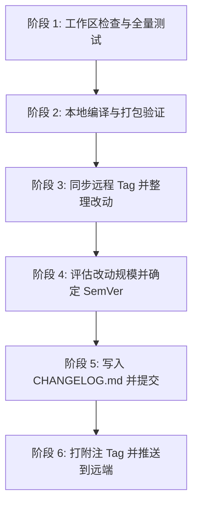

# 项目发版与版本发布流程 (Release Workflow)

本指南规范了 `pvfine` 项目的标准发版流程。在执行发版任务时，按以下六个阶段执行。

---

## 阶段概览



---

## 阶段 1：工作区检查与全量测试

发版前必须确保工作区无未提交的悬挂代码，并保证所有测试 100% 通过。

### 1.1 检查工作区状态
```bash
git status --porcelain
```
- 若工作区存在未提交的代码修改或未跟踪的文件，**不得直接发版**。
- 应先向用户确认这些改动是否应包含在本次发版中。若不需要，需请用户清理或提交后再继续。

### 1.2 执行 Go 单元测试
```bash
go test ./...
```
- 所有 package 的单元测试必须全部通过（`PASS`）。
- 若有任何测试失败，立即终止发版流程并排查。

### 1.3 真实 PVF 集成测试（可选但推荐）
若根目录存在 `Script.pvf` 文件（或环境变量 `PVF_TESTFILE` 已指定），执行真实归档回归测试。由于 `go test ./...` 会在各 package 目录中执行测试，必须将 `PVF_TESTFILE` 转换为绝对路径，避免 `./Script.pvf` 被解析到子 package 目录：
```bash
if [ -n "${PVF_TESTFILE:-}" ] || [ -f "Script.pvf" ]; then
  PVF_FILE="${PVF_TESTFILE:-$PWD/Script.pvf}"
  case "$PVF_FILE" in
    /*) ;;
    *) PVF_FILE="$PWD/$PVF_FILE" ;;
  esac
  PVF_TESTFILE="$PVF_FILE" go test ./...
fi
```

---

## 阶段 2：本地编译与打包验证

确保前端与后端生产编译无报错，类型检查无遗留错误。

### 2.1 前端类型检查与构建
进入前端目录，执行 `vue-tsc` 严格类型检查并构建生产静态资源：
```bash
cd frontend && npm run build && cd ..
```
- 验证没有 TypeScript 类型报错（`vue-tsc` 0 error）。
- 验证 Vite 打包成功产出 `frontend/dist`。

### 2.2 后端 Go 编译验证
验证 Go 整体代码可正常编译：
```bash
go build ./...
```
- 确保所有 package 与 CLI、服务均编译无语法或依赖错误。
- （可选）若宿主环境已安装且配置有 Wails3 CLI，可运行 `wails3 task build` 验证应用包构建。

---

## 阶段 3：同步远程 Tag 与收集改动历史

必须以远程最新的 tag 为基线，避免由于本地 tag 未同步导致版本号或变更记录出现断层。

### 3.1 同步远端 Tag
```bash
git fetch --tags origin
```

### 3.2 获取基线 Tag
```bash
# 获取距离 HEAD 最近的 tag
LATEST_TAG=$(git describe --tags --abbrev=0 2>/dev/null || echo "")
echo "Latest Tag: $LATEST_TAG"
```
- **已有 tag**（如 `v0.0.1`）：取 `$LATEST_TAG..HEAD` 之间的所有 commit。
- **全新仓库/尚无 tag**：以首个提交为基线（`git log --oneline`）。

### 3.3 提取并分析提交历史
```bash
if [ -n "$LATEST_TAG" ]; then
  git log "${LATEST_TAG}..HEAD" --pretty=format:"%h %s"
  git diff --stat "${LATEST_TAG}..HEAD"
else
  git log --pretty=format:"%h %s"
fi
```

### 3.4 整理结构化更新分类
将收集到的 commit 提炼成面向用户的变更记录，按以下类别组织：
- **✨ Features（新特性 / 新功能）**：如新增分屏拖拽、Vim 模式、批处理支持等。
- **🐛 Fixes（问题修复）**：如修复换行偏移、修复文件集删除异常等。
- **⚡ Performance & Optimization（性能与优化）**：如解析加速、内存控制、备份逻辑优化等。
- **🎨 UI / UX（界面与交互改进）**：如右键菜单优化、单击/双击设置等。
- **🔨 Refactor & Maintenance（重构与底层维护）**：如模块解耦、测试补充、依赖调整等。

---

## 阶段 4：评估改动范围与确定版本号 (SemVer)

遵循 [Semantic Versioning 2.0.0](https://semver.org/) 规范，格式为 `vMAJOR.MINOR.PATCH`。

### 4.1 版本号递增规则

| 类型 | 递增位 | 适用场景与判定标准 | 示例 |
| :--- | :--- | :--- | :--- |
| **Patch** | `vX.Y.Z+1` | **纯 Bug 修复**、补丁修复、细微样式微调、文档补充，**完全向下兼容**，无实质新功能。 | `v0.0.1` -> `v0.0.2` |
| **Minor** | `vX.Y+1.0` | **新增向下兼容的功能特性**（如新页面、新交互、支持新格式解析、新增辅助功能），或较大幅度的功能迭代。 | `v0.0.1` -> `v0.1.0` |
| **Major** | `vX+1.0.0` | **存在不向下兼容的重大变更**（如 PVF 解码接口重构、存储格式不兼容变更、重大架构推倒重写），或达到首个稳定生产里程碑（`v1.0.0`）。 | `v0.1.0` -> `v1.0.0` |

### 4.2 确认版本号
- 根据阶段 3 提炼的改动内容，客观评估其影响范围。
- 给出推荐的版本号及评估理由（例如：“从 v0.0.1 至今新增了分屏拖拽、Vim 模式、批处理等多项独立新特性，建议递增 Minor 版本，定为 `v0.1.0`”）。
- 若用户有明确指定的版本号，以用户指定为准。

---

## 阶段 5：更新并提交 CHANGELOG.md

### 5.1 维护 `CHANGELOG.md`
在项目根目录 `CHANGELOG.md` 的顶部（在文件主标题之后）插入新版本的更新记录。若文件不存在，则先创建带标准前言的文件。

条目格式模板：
```markdown
## [vX.Y.Z] - YYYY-MM-DD

### ✨ 新特性
- 新增分屏拖拽与多标签页并排查看功能
- 新增代码编辑器 Vim 模式支持

### 🐛 修复
- 修复标注系统换行计算导致的行号偏移
- 修复删除文件集时缓存未及时清理的问题

### ⚡ 优化
- 增加未保存修改退出时的确认弹窗
- 增加保存确认与源文件自动备份机制
```

### 5.2 提交 CHANGELOG 变更
将 `CHANGELOG.md` 提交到当前分支：
```bash
git add CHANGELOG.md
git commit -m "docs: 更新版本发布记录 <version>"
```
*(提交说明遵循项目风格规范)*

---

## 阶段 6：打附注 Tag 并推送到远端

### 6.1 创建附注 Tag (Annotated Tag)
使用 `git tag -a`，将提炼的更新说明附入 Tag 消息中：
```bash
git tag -a "<version>" -m "<version> 发布

<本次更新要点概括>"
```

### 6.2 推送 Commit 与 Tag
```bash
# 1. 推送当前分支的 CHANGELOG 提交
git push origin HEAD

# 2. 推送新创建的 Tag 到远程仓库
git push origin "<version>"
```

### 6.3 验证发布结果
- 执行 `git describe --tags --exact-match` 确认当前处于新 tag 上。
- 汇总发版结果（版本号、Tag SHA、更新条目数量、远端状态）清晰反馈给用户。
